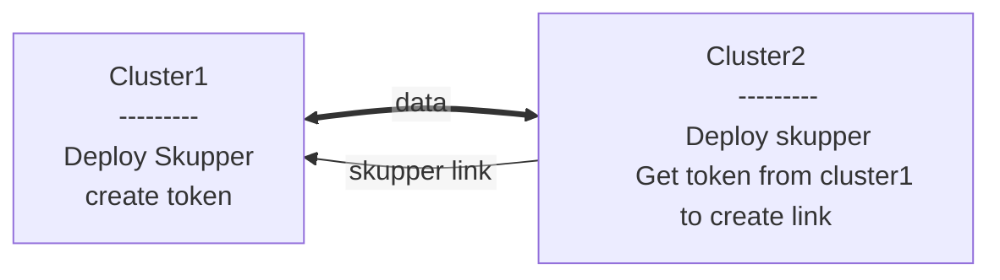
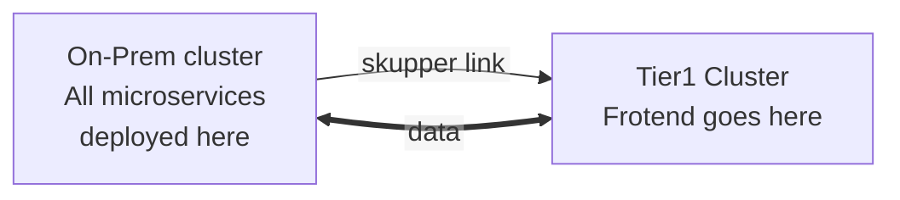
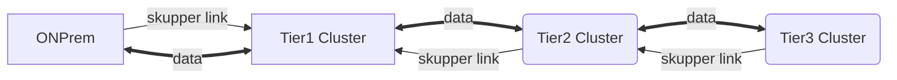

# Migratate the online boutique to different openshift clusters

- [Migratate the online boutique to different openshift clusters](#migratate-the-online-boutique-to-different-openshift-clusters)
  - [Pre-requisites](#pre-requisites)
  - [Clone the code base](#clone-the-code-base)
  - [current state](#current-state)
  - [End state](#end-state)
  - [Migration Steps](#migration-steps)
    - [Install RHSI](#install-rhsi)
      - [OnPrem cluster](#onprem-cluster)
      - [Tier1 cluster](#tier1-cluster)
      - [Tier2 cluster](#tier2-cluster)
      - [Tier3 cluster](#tier3-cluster)
  - [Connect/Link the sites](#connectlink-the-sites)
    - [**Concepts**](#concepts)
    - [**Tier1 cluster**](#tier1-cluster-1)
    - [**OnPrem cluster**](#onprem-cluster-1)
    - [**Tier2 cluster**](#tier2-cluster-1)
    - [**Tier3 cluster**](#tier3-cluster-1)
  - [**Application migration**](#application-migration)
    - [**Tier3 cluster**](#tier3-cluster-2)
    - [Tier2 Cluster](#tier2-cluster-2)
    - [Tier1 Cluster](#tier1-cluster-2)

## Pre-requisites

   1. Skupper cli - Download it [**here**](https://skupper.io/releases/index.html)
   2. oc cli Download it [**here**](http://mirror.openshift.com/pub/openshift-v4/clients/ocp/4.14.0/openshift-client-linux-4.14.0.tar.gz)
   3. Access to openshift clusters 
   

## Clone the code base

Code for deploying the online boutique is in [this](https://github.com/Multi-Cluster/RHSI-Hackathon) git repo
```
git clone https://github.com/Multi-Cluster/RHSI-Hackathon.git

```
   

## current state

  ```mermaid
  %%{init: {"flowchart": {"htmlLabels": false}} }%%
  flowchart LR
      A[["On-Prem cluster
        -------------------
        All microservices
        deployed here"]]
      A  
    
  ```

## End state

  ```mermaid
  %%{init: {"flowchart": {"htmlLabels": false}} }%%
  flowchart LR
      A[["On-Prem cluster
        -------------------
        Decomissioned"]]
        
      B[["Tier1 cluster
        -------------------
        Frontend microservices
        deployed here"]]

      C[["Tier2 cluster
        -------------------
        middleware microservices
        deployed here"]]

      D[["Tier3 cluster
        -------------------
        Payments microservices
        deployed here"]]

    B <--> C <--> D
       
    
  ```

## Migration Steps

### Install RHSI
#### OnPrem cluster
1. Install RHSI in the application namespace on the OnPrem cluster

```
export KUBECONFIG=~/onprem-cluster

oc login

oc project rmallam-base

```

```
skupper init --enable-flow-collector --enable-console --enable-service-sync=false --site-name base  --console-user admin --console-password redh@T

```
#### Tier1 cluster
2. Install RHSI in the frontend namespace on the Tier1 cluster

Create a namespace with a suffix of your team name. 

```
export KUBECONFIG=~/tier1-cluster

oc login

oc new-project rmallam-frontend

```

```
skupper init --enable-flow-collector --enable-console --enable-service-sync=false --site-name frontend --console-user admin --console-password redh@T

```
#### Tier2 cluster
3. Install RHSI in the middleware namespace on the Tier2 cluster

Create a namespace with a suffix of your team name. 

```
export KUBECONFIG=~/tier2-cluster

oc login

oc new-project rmallam-middleware

```

```
skupper init --enable-flow-collector --enable-console --enable-service-sync=false --site-name middleware --console-user admin --console-password redh@T

```
#### Tier3 cluster
3. Install RHSI in the middleware namespace on the Tier3 cluster

Create a namespace with a suffix of your team name.

```
export KUBECONFIG=~/tier3-cluster

oc login 

oc new-project rmallam-payments

```

```
skupper init --enable-flow-collector --enable-console --enable-service-sync=false --site-name payments --console-user admin --console-password redh@T

```

## Connect/Link the sites

### **Concepts**

1. Each namespaces where skupper is deployed is called a **SITE**.
2. Communication between sites is established by **LINKS**
3. **TOKENS** are exchanged between sites to Trust and establish **LINKS**
4. **TOKENS** can be generated on any site and exchanged with other sites to establish **LINKS**
5. LINK are UNI-DIRECTIONAL but the exchange of data between sites is  BI-DIRECTIONAL. 
6. As a best practise, Always establish link from a MOST TRUSTED ZONE/CLUSTER to a LESSER TRUESTED ZONE/CLUSTER. In our example Tier3 cluster is the most trusted, so the link originates from here.



### **Tier1 cluster**
1. create a token on the tier1 cluster

```
export KUBECONFIG=~/tier1-cluster

oc project rmallam-frontend

skupper token create frontend.yaml --uses=2 

# this will create a file called frontend.yaml in the current working directory
 
```
### **OnPrem cluster**
2. Use the token generated to create a link with on prem cluster. copy the frontend.yaml to your current working directory if not already available.

```
export KUBECONFIG=~/onprem-cluster

oc apply -f frontend.yaml -n rmallam-base

```

### **Tier2 cluster**
3. use the same token to create a link from tier2

```
export KUBECONFIG=~/tier2-cluster

oc apply -f frontend.yaml -n rmallam-middleware

```


4. Create a token on middleware namespace in Tier2 cluster to establish a link with Payments namespace in Tier3 cluster

```
export KUBECONFIG=~/tier2-cluster

skupper token create middleware.yaml

```
### **Tier3 cluster**
5. Use the middleware.yaml token created in the previous step to establish a link from payments namespace in tier3 cluster to middleware namespace in tier2 cluster

```
export KUBECONFIG=~/tier3-cluster

oc apply -f middleware.yaml -n rmallam-payments

```

## **Application migration**

### **Tier3 cluster**

1. starting with the most restricted applications first. payments and email service should go onto payments namespace in tier3 cluster. From the root folder of this repository, navigate to the `online-boutique/Openshift/` directory and apply the mainfests.

    ```bash
    cd online-boutique/Openshift/
    export KUBECONFIG=~/tier3-cluster
    oc apply -f payments
    ```

    ```

    service/emailservice created
    service/paymentservice created
    deployment.apps/emailservice created
    deployment.apps/paymentservice created
    ```
    ```
    oc get pods
    emailservice-5766bd4fc8-nnngf                1/1     Running   0          60s
    paymentservice-c6f48ffb6-zv8jv               1/1     Running   0          60s
    skupper-prometheus-59db49845c-xzrdr          1/1     Running   0          4h13m
    skupper-router-6548887ddf-mpscl              2/2     Running   0          4h13m
    skupper-service-controller-9c66bf75f-4ffc4   2/2     Running   0          4h13m
    ```

2. expose the payment and email services via skupper.
   

   ```
   skupper expose deployment paymentservice

   deployment paymentservice exposed as paymentservice
   ```
   
   ```
   skupper expose deployment emailservice

   deployment emailservice exposed as emailservice
   ```

### Tier2 Cluster

1. The middleware services we are deploying now will interact with payments and email service using the service names but they are not available here because the skupper is deployed with service sync disabled. We have to create them manually using the commands below.
   ```
   export KUBECONFIG=~/tier2-cluster
   ```
  ```
  skupper service create paymentservice --protocol tcp 50051

  skupper service create emailservice --protocol tcp 8080

  ```

2. From the root folder of this repository, navigate to the `online-boutique/Openshift/` directory and apply the mainfests.

    ```bash
    cd online-boutique/Openshift/
   
    ```
    ```
    oc apply -f middleware
    ```
    ```
    service/adservice created
    service/cartservice created
    service/checkoutservice created
    service/currencyservice created
    service/productcatalogservice created
    service/recommendationservice created
    service/redis-cart created
    service/shippingservice created
    deployment.apps/adservice created
    deployment.apps/cartservice created
    deployment.apps/checkoutservice created
    deployment.apps/currencyservice created
    deployment.apps/productcatalogservice created
    deployment.apps/recommendationservice created
    deployment.apps/redis-cart created
    deployment.apps/shippingservice created
    ```
    ```
    $oc get pods
    ```
    ```
    NAME                                         READY   STATUS    RESTARTS   AGE
    adservice-68448666d6-skvb2                   1/1     Running   0          34s
    cartservice-5fdd4bf56f-5vd5c                 1/1     Running   0          33s
    checkoutservice-f87cf5864-gz4rv              1/1     Running   0          33s
    currencyservice-6cf5b4d57b-vcpx9             1/1     Running   0          33s
    productcatalogservice-595b7b5884-47rtj       1/1     Running   0          32s
    recommendationservice-5d8b99449d-rdk42       1/1     Running   0          32s
    redis-cart-59c4c557db-nh4nm                  1/1     Running   0          32s
    shippingservice-64cf4f6998-gnkqn             1/1     Running   0          31s
    skupper-prometheus-59db49845c-xzrdr          1/1     Running   0          5h4m
    skupper-router-6548887ddf-mpscl              2/2     Running   0          5h4m
    skupper-service-controller-9c66bf75f-4ffc4   2/2     Running   0          5h4m
    ```
  
2. Expose all the services deployed via skupper
  ```
  $for i in adservice cartservice checkoutservice currencyservice productcatalogservice recommendationservice redis-cart shippingservice; do skupper expose deployment $i; done
  ```
  ```
  deployment adservice exposed as adservice
  deployment cartservice exposed as cartservice
  deployment checkoutservice exposed as checkoutservice
  deployment currencyservice exposed as currencyservice
  deployment productcatalogservice exposed as productcatalogservice
  deployment recommendationservice exposed as recommendationservice
  deployment redis-cart exposed as redis-cart
  deployment shippingservice exposed as shippingservice
  ```

### Tier1 Cluster

1. Like we did in tier2 cluster, all the middleware services deployed in tier2 cluster will not be visible to frontend cluster, Hence we will create them using the skupper cli.
  ```
  export KUBECONFIG=~/tier1-cluster
  ```
  ```
  skupper service create adservice --protocol tcp 9555
  skupper service create cartservice --protocol tcp 7070
  skupper service create checkoutservice --protocol tcp 5050
  skupper service create productcatalogservice --protocol tcp 3550
  skupper service create recommendationservice --protocol tcp 8080
  skupper service create redis-cart --protocol tcp 6379
  skupper service create shippingservice --protocol tcp 50051
  skupper service create currencyservice --protocol tcp 7000
  ```

2.  From the root folder of this repository, navigate to the `online-boutique/Openshift/` directory and apply the mainfests.

    ```bash
    cd online-boutique/Openshift/
    oc apply -f frontend 
    ```
    ```
    service/frontend created
    deployment.apps/frontend created
    route.route.openshift.io/frontend created
    ```
    ```
    $oc get pods
    ```
    ```
    NAME                                         READY   STATUS    RESTARTS   AGE
    frontend-7b65d55cbd-ff5ws                    1/1     Running   0          48s
    skupper-prometheus-59db49845c-xzrdr          1/1     Running   0          5h13m
    skupper-router-6548887ddf-mpscl              2/2     Running   0          5h13m
    skupper-service-controller-9c66bf75f-4ffc4   2/2     Running   0          5h13m
    ```
    ```
    skupper expose deployment frontend
    ```

    ### ONPrem cluster

    1. expose frontend via skupper

  ```
  export KUBECONFIG=~/onprem-cluster
  ```
  ```
  skupper expose deployment frontend
  ```
    2. Scale down all the pods and check if the exisitng route is still working 

  ```
  for i in adservice cartservice checkoutservice currencyservice productcatalogservice recommendationservice redis-cart shippingservice emailservice paymentservice; do oc scale deploy $i --rep
  licas=0 ;done
  ```

    ```bash
    oc get route frontend -o jsonpath='{.spec.host}'
    ```