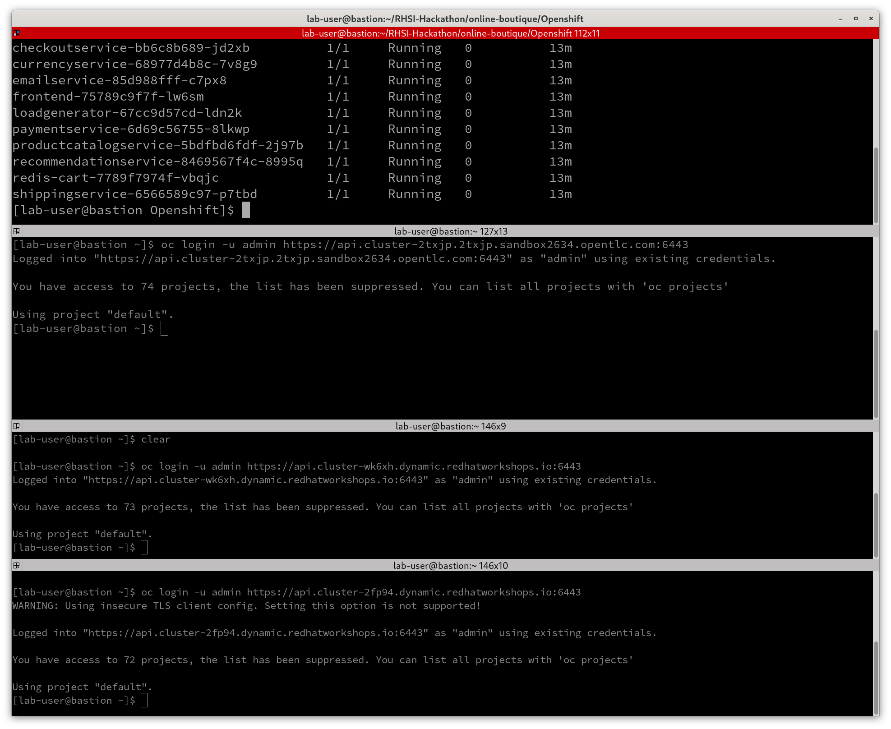

# Red Hat Service Interconnect - February APAC Hackathon

# Scenario 1 - Service Sync ENABLED

## Step 1: Inventory of "Monoliths" Existing Pods
Begin by reviewing the deployment that was provided for you.

Replace ``<your-team>`` with the team name provided by your facilitator.  
Using the  project ```<your-team>-base-s1``` on the ```on-prem``` cluster, get all the pods.

```
oc login -u <your-team> <cluster url>

oc project <yourteam>-base-s1

oc get pods

```

The following pods are currently set up:

```
NAME                                     READY   STATUS    RESTARTS   AGE
adservice-76bdd69666-ckc5j               1/1     Running   0          2m58s
cartservice-66d497c6b7-dp5jr             1/1     Running   0          2m59s
checkoutservice-666c784bd6-4jd22         1/1     Running   0          3m1s
currencyservice-5d5d496984-4jmd7         1/1     Running   0          2m59s
emailservice-667457d9d6-75jcq            1/1     Running   0          3m2s
frontend-6b8d69b9fb-wjqdg                1/1     Running   0          3m1s
loadgenerator-665b5cd444-gwqdq           1/1     Running   0          3m
paymentservice-68596d6dd6-bf6bv          1/1     Running   0          3m
productcatalogservice-557d474574-888kr   1/1     Running   0          3m
recommendationservice-69c56b74d4-7z8r5   1/1     Running   0          3m1s
redis-cart-5f59546cdd-5jnqf              1/1     Running   0          2m58s
shippingservice-6ccc89f8fd-v686r         1/1     Running   0          2m58s
```

Get the route so you can access the application via the route. Note that it is HTTP, not HTTPS in the url.  
```
oc get routes
```
E.g. http://frontend-team1-base-s1.apps.cluster-2txjp.2txjp.sandbox2634.opentlc.com  

## Step 2: Access the Three Target OpenShift Clusters

***In separate terminal windows***, login to the ```AWS MELB``` and ```AWS SYD``` and ```AWS SING``` OpenShift (OCP) clusters. E.g.:  

     


The application will be deployed into three tiers distributed across the three clusters. The project/cluster mapping is:  
  | Project | Cluster | Notes |
  |---------|---------|-------|
  | < your-team >-base-s1 | ON-PREM | Full single-namespace application |
  | < your-team >-tier1-s1 | AWS MELB | Front end services |
  | < your-team >-tier2-s1 | AWS SYD | Cart, Product Catalog, Currency, Shipping, Checkout, Recommendation, Ad, and Redis cache |
  | < your-team >-tier3-s1 | AWS SING | Payment and Email services. |  


## Step 3: Create the namespaces

Because we will be progressively migrating and avoiding application outages, we must first deploy Service Interconnect into each project.  

Using the naming convention in the table above, create the namespaces in each cluster. E.g. on the ``AWS MELB`` cluster you would enter this command:  

```
oc new-project <your-team>-tier1-s1
```


## Step 4: Skupper Initialisation
Once you have created each project, install Service Interconnect.

#### On Premises (Base Application)
```
skupper init --site-name on-prem --enable-console --enable-flow-collector --console-auth=internal --console-user=admin --console-password=password
```

#### AWS-MELB (Tier 1)
```
skupper init --site-name tier-1 --enable-console --enable-flow-collector --console-auth=internal --console-user=admin --console-password=password
```


#### AWS-SYD (Tier 2)
```
skupper init --site-name tier-2 --enable-console --enable-flow-collector --console-auth=internal --console-user=admin --console-password=password
```


#### AWS-SING (Tier 3)
```
skupper init --site-name tier-3 --enable-console --enable-flow-collector --console-auth=internal --console-user=admin --console-password=password
```

**Note:** From this point forward we will refer to each project as ```Base```, ```Tier 1```, ```Tier 2```, or ```Tier 3```.

You have now installed Service Interconnect. You can access the Service Interconnect console through the route. E.g. In the ```Base``` project, 
```
oc get route skupper
```

Paste the route from above into your browser.  The username/password is: ``admin/password``. Keep this tab open and use it to observe what is happening in the network as you proceed through the steps.

   


## Step 5: Create the Service Interconnect Network

Next create the links between the sites. The links will be established in the direction of "most trusted site" to "less trusted site." I.e. **Base --> Tier 3 --> Tier 2 --> Tier 1**

Note, because we are migrating tiers one at a time we would most likely establish the link according to this table (where Site A is higher trust than Site B):

| Site A | Site B |
| -------|--------|
| Base | Tier 1, Tier 2, Tier 3 |
| Tier 3 | Tier 2 |
| Tier 2 | Tier 1 |

This would stop the network flows bewteen Tier 2/Tier 3 and Tier 1/Tier 2 always having to flow through Base. We won't do that because the instructions become more complex. However, you can do this yourself if you like.

This direction is important because endorsed network paths typically flow form high trust to low trust and not the other way around.

### Commands:

#### Tier 1
1. Generate a token.

```
skupper token create ~/tier1.token
cat tier1.token
```

#### Tier 2:  
1. Copy the token and create a file ``tier1.token``.
2. Create the link from thei Tier 2 to Tier 1 site:
```
skupper link create ~/tier1.token
```

Now repeat this process to crate a link between the Tier 2 and Tier 3 sites:

#### Tier 2:
1. Generate a token.  
```
skupper token create ~/tier2.token
cat tier2.token
```

#### Tier 3:
1. Copy the token and create a file ``tier2.token``.
2. Create the link from the Tier 3 to Tier 2 site:  
```
skupper link create ~/tier2.token
```

### Tier 3:
1. Generate a token  
```
skupper token create ~/tier3.token
cat tier3.token
```

#### Base:
1. Copy the token and create a file ``tier3.token``.
2. Create the link from the Base to Tier 3 site:  
```
skupper link create ~/tier3.token
```

Observe the network status in the Service Interconnect Console:

   


You can also view the network topology from the command line:  
```
$ skupper network status

Sites:
├─ [local] 132f381b-aa11-440c-a0e1-eb2300050096(bryon-base-s1) 
│  │ namespace: bryon-base-s1
│  │ site name: on-prem
│  │ version: 1.5.3
│  ╰─ Linked sites:
│     ╰─ dc7a5c3e-f4b5-4a58-8eee-695a0d9c90de(bryon-tier3)
│        direction: outgoing
├─ [remote] dc7a5c3e-f4b5-4a58-8eee-695a0d9c90de(bryon-tier3) 
│  │ namespace: bryon-tier3
│  │ site name: tier-3
│  │ version: 1.5.3
│  ╰─ Linked sites:
│     ├─ 3fee8ed7-2f0e-4632-bc50-194952d1aae9(bryon-tier2)
│     │  direction: outgoing
│     ╰─ 132f381b-aa11-440c-a0e1-eb2300050096(bryon-base-s1)
│        direction: incoming
├─ [remote] 3fee8ed7-2f0e-4632-bc50-194952d1aae9(bryon-tier2) 
│  │ namespace: bryon-tier2
│  │ site name: tier-2
│  │ version: 1.5.3
│  ╰─ Linked sites:
│     ├─ dc7a5c3e-f4b5-4a58-8eee-695a0d9c90de(bryon-tier3)
│     │  direction: incoming
│     ╰─ 5f801c01-f0e6-4e68-b674-d61782b1701d(bryon-tier1)
│        direction: outgoing
╰─ [remote] 5f801c01-f0e6-4e68-b674-d61782b1701d(bryon-tier1) 
   │ namespace: bryon-tier1
   │ site name: tier-1
   │ version: 1.5.3
   ╰─ Linked sites:
      ╰─ 3fee8ed7-2f0e-4632-bc50-194952d1aae9(bryon-tier2)
         direction: incoming
```

You can also view the link status of each site. E.g. In Tier 3


```
skupper link status

Links created from this site:

	 Link link1 is connected

Current links from other sites that are connected:

	 Incoming link from site 132f381b-aa11-440c-a0e1-eb2300050096 on namespace bryon-base-s1
```
Here you can see one inbound link and one outbound link.


### Step 6: Deploy Microservices

1. Clone the Online Boutique microservices demo repository into the Tier 1, Tier 2, and Tier 3 workstations (bastions):  
  ```
  git clone https://github.com/Multi-Cluster/RHSI-Hackathon.git
  ```

2. Change to the Openshift directory:  
  ```
  cd RHSI-Hackathon/online-boutique/Openshift/
  ```

3. Deploy each layer into the respective cluster.  

| Cluster | Command | Role |
|---------|---------|------|
| Tier 1 | ``oc apply -f tier1 --recursive`` | The Tier 1 cluster will host the frontend. |
| Tier 2 | ``oc apply -f tier2 --recursive`` | The Tier 2 cluster will host all the middleware |
| Tier 3 | ``oc apply -f tier3 --recursive`` | The Tier 3 custer will host the backend components |

E.g. On Tier 1:``
```
oc apply -f frontend --recursive
```

Verify that the pods are deployed in the cluster:

```
oc get pods
NAME                                          READY   STATUS    RESTARTS   AGE
frontend-75789c9f7f-grfkc                     1/1     Running   0          30s
skupper-prometheus-6fc68fc6c6-86t57           1/1     Running   0          80m
skupper-router-77464544dc-vkzg4               2/2     Running   0          80m
skupper-service-controller-849f66bff5-qlw6g   2/2     Running   0          80m
```

Get the pods for each Tier and ensure they have all started before proceeding.


### Step 7: Expose Services via Skupper
At this point we have made all the deployments to the different sites, but we have not published the services so they can be reached over the Service Interconnect Network. If you view the topology in the Service Interconnect Console you will observe that despite being deployed, nothing is communicating over Service Interconnect:

   


So now we will go ahead and wire everything up...

Expose each microservice deployment in its respective namespace/cluster using Skupper.

Expose the Tier 3 services to the network.

Tier 3: 
```
skupper expose deployment emailservice && \
skupper expose deployment paymentservice
```

Tier 2:

```
skupper expose deployment adservice && \
skupper expose deployment cartservice && \
skupper expose deployment checkoutservice && \
skupper expose deployment currencyservice && \
skupper expose deployment productcatalogservice && \
skupper expose deployment recommendationservice && \
skupper expose deployment redis-cart && \
skupper expose deployment shippingservice
```

Observe the changes in the Services annotations.

```
oc get svc emailservice -o yaml | grep selector -A 4

  selector:
    application: skupper-router
    skupper.io/component: router
  sessionAffinity: None
  type: ClusterIP
```

So you have now deployed all three tiers of the application. So the next step is to scale down the on-premises components while leaving the on-premises route in place. Service Interconnect will route the traffic to the component in Tier1, 2, or 3 as required.

### Step 8: Decommision On Premsies

Lets start by just scaling down one component.

**On-Premises Cluster**

```
oc scale --replicas=0 deployment cartservice
```

Now open the store web site and try adding something to the cart. Open the Service Interconnect Console and observe the traffic is flowing from On-Premises to Tier 2. **Note, your screen will look slightly different to this example.**

   


Now scale down the rest of the on-premises application. When wehave done that there will be no pods running on-premises, but the route will still be going via the on-premises cluster. This is a perfect example of how Service Interconnect creates a locationless application and how it enables progressive migration with zero downtime.

First we expose the frontend deployment to Service INterconnect so the route will remain interrupted when we scale the frontend down. 

***Please pay attention to which cluster you run these command on or everything will break.***

**On the Tier 1 Cluster**

```
skupper expose deployment frontend
```

**On the Base Cluster**

Now we scale down the rest of the application:  
```
oc scale --replicas=0 deployment frontend  && \
oc scale --replicas=0 deployment adservice  && \
oc scale --replicas=0 deployment cartservice && \
oc scale --replicas=0 deployment checkoutservice && \
oc scale --replicas=0 deployment currencyservice && \
oc scale --replicas=0 deployment emailservice && \
oc scale --replicas=0 deployment paymentservice && \
oc scale --replicas=0 deployment productcatalogservice && \
oc scale --replicas=0 deployment recommendationservice && \
oc scale --replicas=0 deployment redis-cart && \
oc scale --replicas=0 deployment shippingservice
```

Visit the frontend URL from the On-Prem namespace and perform actions like adding items to the cart and making payments to verify functionality. 

From here, you should be able to go and Add to Cart and Place an Order.

Your application has now been migrated. As a stretch objective you can update the Route53 to point to the Tier 1 cluster and then delete the On-Premises namespace entitrely.

View the result in the Service Interconnect Console. Note that it may take a few minutes for the links from on-premises to the Tier 1/2/3 site to disappear.

   


#### Screenshots

| Home Page                                                                                                         | Checkout Screen                                                                                                    |
| ----------------------------------------------------------------------------------------------------------------- | ------------------------------------------------------------------------------------------------------------------ |
| [](/docs/img/boutique_landing.png) | [](/docs/img/placed_order.png) |


