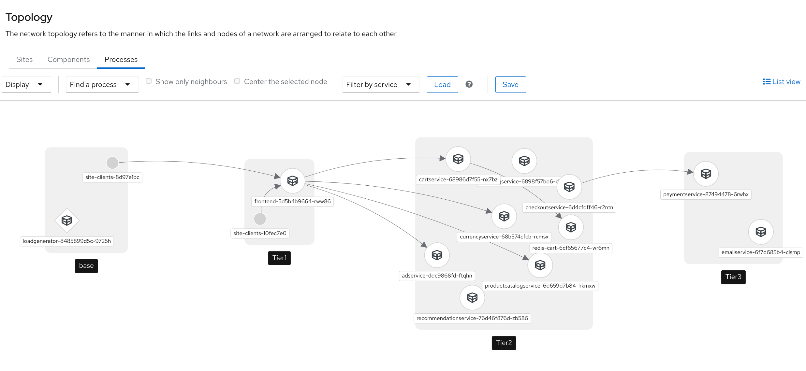

# Red Hat Service Interconnect - February APAC Hackathon

# Scenario 2 - Service Sync Disabled
## Introduction
In the first scenario, you configured the Service Interconnect to publish exposed services globally over the mesh network. This is a great feature when you want to make services reachable from anywhere. However, this is not an apporach you will always want to adopt. In our example, you ony ever want Tier 1 to talk to services in Tier 2, and Tier 2 to talk to services in Tier 3.

**Service Sync is the feature that you use to control where services are published.**

In this scenario you will restrict the visibility of services.

The initial steps for this scenario are **ALMOST** exactly the same as Scenario 1. For scenario 2's Break Glass instructions you will repeat steps 1-6 from Scenario 1 **WITH THE FOLLOWING EXCEPTIONS**. We have not repeated the steps from Scenario 1 - so pay careful attention to the differences described here before you get going.

### Project Differences
The application will be deployed into three tiers distributed across the three clusters. The project/cluster mapping is:  
  | Project | Cluster | Notes |
  |---------|---------|-------|
  | < your-team >-base-s2 | ON-PREM | Full single-namespace application |
  | < your-team >-tier1-s2 | AWS MELB | Front end services |
  | < your-team >-tier2-s2 | AWS SYD | Cart, Product Catalog, Currency, Shipping, Checkout, Recommendation, Ad, and Redis cache |
  | < your-team >-tier3-s2 | AWS SING | Payment and Email services. | 

### Service Interconnect installation differences.

When installing sService Interconnect into a namespace you need to specify an additional option ``--service-sync=false``. E.g.:  
``skupper init --enable-flow-collector --enable-console --enable-service-sync=false --site-name base  --console-user admin --console-password password``  

Initialising Service Interconnect with ``--service-sync=false`` will result in any exposed deployment not being immediately visible at the other sites. You will need to manually create the service at the remote site.

## Steps
First, repeate Steps 1 through 6 in the Scenario 1 Break Glass.

## Stap 7: Expose the Deployments in Each Tier

Expose the services in each application tier to the Service Interconnect network.

### OnPrem:

```
skupper expose deployment emailservice && \
skupper expose deployment paymentservice && \
skupper expose deployment adservice && \
skupper expose deployment cartservice && \
skupper expose deployment checkoutservice && \
skupper expose deployment currencyservice && \
skupper expose deployment productcatalogservice && \
skupper expose deployment recommendationservice && \
skupper expose deployment redis-cart && \
skupper expose deployment shippingservice && \
skupper expose deployment frontend
```

### Tier 3: 
```
skupper expose deployment emailservice && \
skupper expose deployment paymentservice
```

### Tier 2:

```
skupper expose deployment adservice && \
skupper expose deployment cartservice && \
skupper expose deployment checkoutservice && \
skupper expose deployment currencyservice && \
skupper expose deployment productcatalogservice && \
skupper expose deployment recommendationservice && \
skupper expose deployment redis-cart && \
skupper expose deployment shippingservice
```

### Tier 1:
We want the original route to reach the new Tier 1 so we need to expose the frontend in Tier 1 to the route in Base.
```
skupper expose deployment frontend
```

## Review What You Have Done

### On the Tier 2 Cluster

You have now exposed the deployments to the mesh network, but they are not automatically visible to the other sites. E.g. On the ``AWS-MELB`` site type the command ``oc get svc``
```
$ oc get svc
NAME                    TYPE        CLUSTER-IP     EXTERNAL-IP   PORT(S)                        AGE
adservice               ClusterIP   10.217.4.109   <none>        9555/TCP                       6m20s
cartservice             ClusterIP   10.217.5.211   <none>        7070/TCP                       6m20s
checkoutservice         ClusterIP   10.217.5.104   <none>        5050/TCP                       6m20s
currencyservice         ClusterIP   10.217.5.22    <none>        7000/TCP                       6m20s
productcatalogservice   ClusterIP   10.217.5.241   <none>        3550/TCP                       6m20s
recommendationservice   ClusterIP   10.217.4.230   <none>        8080/TCP                       6m20s
redis-cart              ClusterIP   10.217.4.106   <none>        6379/TCP                       6m19s
shippingservice         ClusterIP   10.217.4.218   <none>        50051/TCP                      6m19s
skupper                 ClusterIP   10.217.5.74    <none>        8010/TCP,8080/TCP              50m
skupper-prometheus      ClusterIP   10.217.4.175   <none>        9090/TCP                       50m
skupper-router          ClusterIP   10.217.5.226   <none>        55671/TCP,45671/TCP,8081/TCP   50m
skupper-router-local    ClusterIP   10.217.5.56    <none>        5671/TCP                       50m
```
Observe that the frontend or payments services are not visible. Only what has been deployed in Tier 2.

## Step 8: Import the Tier 3 Services to Tier 2
In the **Tier 2** cluster, enter the following commands to make the Tier 3 services available:

```
skupper service create paymentservice --protocol tcp 50051

skupper service create emailservice --protocol tcp 8080
```

Observe they are now available, but there are nbo pods running for them.

```
$ oc get svc
NAME                    TYPE        CLUSTER-IP     EXTERNAL-IP   PORT(S)                        AGE
adservice               ClusterIP   10.217.4.109   <none>        9555/TCP                       12m
cartservice             ClusterIP   10.217.5.211   <none>        7070/TCP                       12m
checkoutservice         ClusterIP   10.217.5.104   <none>        5050/TCP                       12m
currencyservice         ClusterIP   10.217.5.22    <none>        7000/TCP                       12m
emailservice            ClusterIP   10.217.5.33    <none>        8080/TCP                       2s
paymentservice          ClusterIP   10.217.5.76    <none>        50051/TCP                      11s
productcatalogservice   ClusterIP   10.217.5.241   <none>        3550/TCP                       12m
recommendationservice   ClusterIP   10.217.4.230   <none>        8080/TCP                       12m
redis-cart              ClusterIP   10.217.4.106   <none>        6379/TCP                       12m
shippingservice         ClusterIP   10.217.4.218   <none>        50051/TCP                      12m
skupper                 ClusterIP   10.217.5.74    <none>        8010/TCP,8080/TCP              56m
skupper-prometheus      ClusterIP   10.217.4.175   <none>        9090/TCP                       56m
skupper-router          ClusterIP   10.217.5.226   <none>        55671/TCP,45671/TCP,8081/TCP   56m
skupper-router-local    ClusterIP   10.217.5.56    <none>        5671/TCP                       56m
```
Observe the remote Payments and Email services are now available in Tier 2.

```
$ oc get pods
NAME                                          READY   STATUS    RESTARTS   AGE
adservice-ddc9868fd-ftqhn                     1/1     Running   0          12m
cartservice-68986d7f55-nx7bz                  1/1     Running   0          12m
checkoutservice-6d4cfdff46-r2ntn              1/1     Running   0          12m
currencyservice-68b574cfcb-rcmsx              1/1     Running   0          12m
productcatalogservice-6d659d7b84-hkmxw        1/1     Running   0          12m
recommendationservice-76d46f876d-zb586        1/1     Running   0          12m
redis-cart-6cf65677c4-wr6mn                   1/1     Running   0          12m
shippingservice-6898f57bd6-djrn7              1/1     Running   0          12m
skupper-prometheus-867f57b89-fv9rw            1/1     Running   0          56m
skupper-router-75965f5ddb-5rvrp               2/2     Running   0          56m
skupper-service-controller-7b56c54477-9x4vn   2/2     Running   0          56m
```
Observe there are no pods for the Payments and Email services


## Step 9: Import the Tier 2 Services to Tier 1

The next step is to make the Tier 2 services that were exposed to the RHSI network visible in Tier 1. 

### In the Tier 1 Cluster
Run the folling command:

```
skupper service create adservice --protocol tcp 9555 && \
skupper service create cartservice --protocol tcp 7070 && \
skupper service create checkoutservice --protocol tcp 5050 && \
skupper service create productcatalogservice --protocol tcp 3550 && \
skupper service create recommendationservice --protocol tcp 8080 && \
skupper service create redis-cart --protocol tcp 6379 && \
skupper service create shippingservice --protocol tcp 50051 && \
skupper service create currencyservice --protocol tcp 7000
```

Observe that the Tier 2 services are now available in Tier 1:
```
$ oc get svc
NAME                    TYPE        CLUSTER-IP     EXTERNAL-IP   PORT(S)                        AGE
adservice               ClusterIP   10.217.4.53    <none>        9555/TCP                       74s
cartservice             ClusterIP   10.217.5.215   <none>        7070/TCP                       7s
checkoutservice         ClusterIP   10.217.4.192   <none>        5050/TCP                       6s
currencyservice         ClusterIP   10.217.5.118   <none>        7000/TCP                       3s
frontend                ClusterIP   10.217.4.182   <none>        8080/TCP                       21h
productcatalogservice   ClusterIP   10.217.5.73    <none>        3550/TCP                       5s
recommendationservice   ClusterIP   10.217.4.81    <none>        8080/TCP                       5s
redis-cart              ClusterIP   10.217.5.197   <none>        6379/TCP                       4s
shippingservice         ClusterIP   10.217.4.136   <none>        50051/TCP                      4s
skupper                 ClusterIP   10.217.4.224   <none>        8010/TCP,8080/TCP              22h
skupper-prometheus      ClusterIP   10.217.5.240   <none>        9090/TCP                       22h
skupper-router          ClusterIP   10.217.4.131   <none>        55671/TCP,45671/TCP,8081/TCP   22h
skupper-router-local    ClusterIP   10.217.5.174   <none>        5671/TCP                       22h

```

But notice that there are no pods for the Tier 2 services.
```
$ oc get pods
NAME                                          READY   STATUS    RESTARTS   AGE
frontend-5d5b4b9664-rww86                     1/1     Running   1          22h
skupper-prometheus-867f57b89-ckx8b            1/1     Running   1          23h
skupper-router-7c4ffb9bbd-d8l4n               2/2     Running   2          23h
skupper-service-controller-866df67fdc-2gjvx   2/2     Running   2          23h
```

## Make the Frontend Available to the Base Cluster
Finally, we want to redirect the frontend from the Base cluster to the new Tier 1. This is how we do the cutover with no downtime.

### On the Base Cluster
Run the following command:
```
skupper service create frontend 8080
```

We can now scale the entire applicatuion running on the Base cluster down.

## Step 10: Decommission the On-Premises Application

Decommission the On-Premises application by scaling everything down to zero.
```
oc scale --replicas=0 deployment frontend  && \
oc scale --replicas=0 deployment adservice  && \
oc scale --replicas=0 deployment cartservice && \
oc scale --replicas=0 deployment checkoutservice && \
oc scale --replicas=0 deployment currencyservice && \
oc scale --replicas=0 deployment emailservice && \
oc scale --replicas=0 deployment paymentservice && \
oc scale --replicas=0 deployment productcatalogservice && \
oc scale --replicas=0 deployment recommendationservice && \
oc scale --replicas=0 deployment redis-cart && \
oc scale --replicas=0 deployment shippingservice
```

### On the Base Cluster
Open the route for the frontend on the Base cluster and you should be able to access the application

```
oc get route frontend
```

Copy the url into your browser, but make sure you add **http://** to the front **(NOT https://)** of the url. E.g.
```
$ oc get route frontend
NAME       HOST/PORT                                 PATH   SERVICES   PORT       TERMINATION   WILDCARD
frontend   frontend-team-a-base-s2.apps-crc.testing          frontend   port8080                 None
```

Would create this url:  ``http://frontend-team-a-base-s2.apps-crc.testing``


# Review Your Work
Open the Service Interconnect Console and observe the new topology

    
